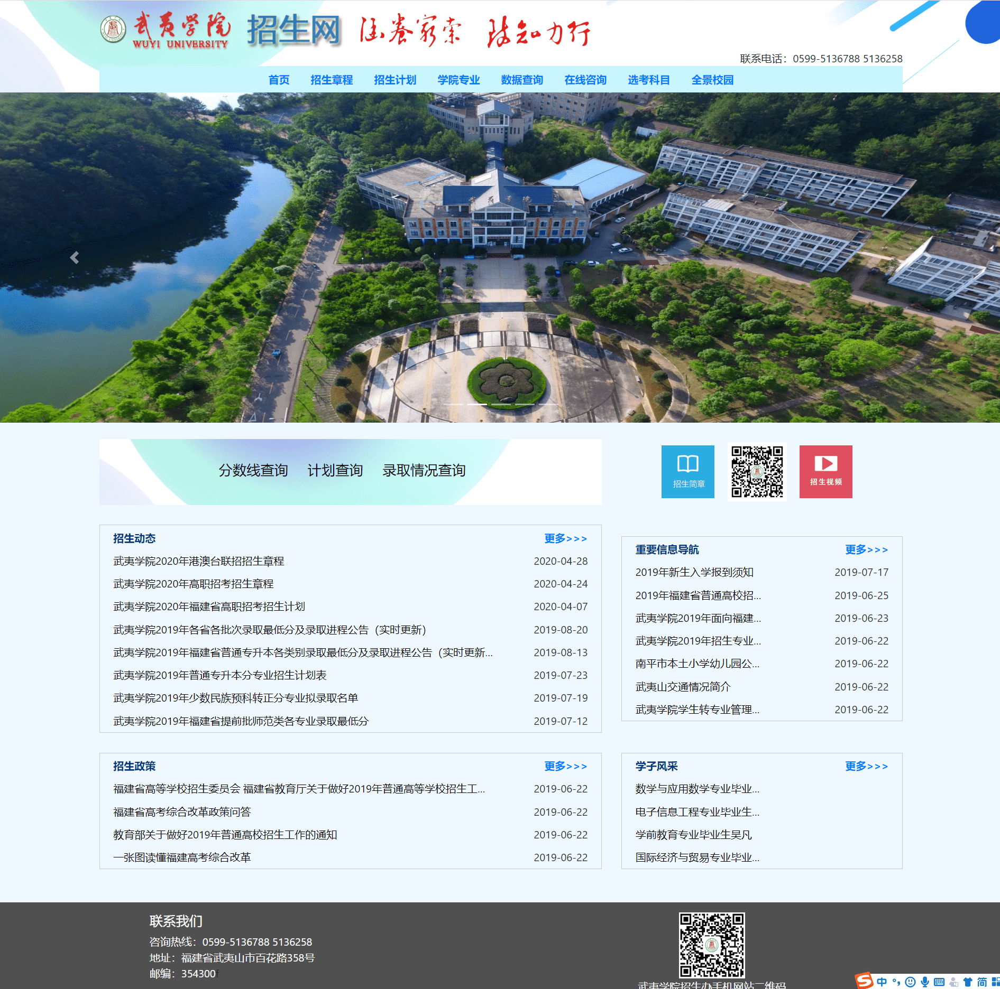

> 2. # coder 猪的个人笔记及部分项目展示
>
>    ### 小程序项目
>
>    ##### 1.给它家微信小程序
>
> > 项目概况：
> >
> >  这是一个为爱心人士提供一个信息交流、分享记录救助经历、直连动保机构的平台；为动保机构提供一个直面爱心人士的推广互动渠道并提供活动与机构与收容动物的电子化管理服务
> >
> > 项目状态：
> >
> >  本项目现与福建最大的动保协会之一莆田市动物保护协会合作，并在当地市电视台播出介绍。
> >
> >  本项目服务于动保机构，帮助机构完成电子化转型，成为沟通动保机构与爱心人士的平台，公关大量动保机构，借助动保机构的巨大私域流量，拉取初段用户，通过社区运营与功能提升，增加用户粘度，将“机构用户”转换为“平台用户”，通过公益背景与动保背书建设“专业，可靠”的形象获取游离的用户，继而迭代养宠等其他功能，立足于宠物市场拓宽业务。
> >
> >  上线时间：一年半，扫描下方二维码可查看
>
> 
>
>  莆田电视台报导介绍：
> 本地视频：./video/莆田电视台报导介绍.mp4
> 在线链接：https://m.weibo.cn/status/4591050587636151?
> <video width="500" height="240" controls>
>      <source src="video/莆田电视台报导介绍.mp4" type="video/mp4">
> </video>
> 
> 项目截图：
> 
>

> 
>
> 2.玩转旅游微信小程序
>
> 
>
> ### PC 端项目
>
> > 1. 个人码云地址: [https://gitee.com/JSshuai2015](https://gitee.com/JSshuai2015)
> > 2. 武夷学院招生办: http://211.80.247.190/recruit/index.html
> > 3. 武夷学院朱子理学研究中心：http://www.wuyiu.edu.cn/zzx/
> > 4. 客币网：无网址
> > 5. 武院校园菌后台：无网址
>
> 1.客币网展示（由于商用了，面向东亚用户的，此处只展示图片）
>
> 
>
> 
>
> 2.武夷学院招生办
>
> 
>
> 3.武院校园菌后台
>
> 
>
> 4.朱子理学研究中心
>
> 
>
> ### 移动端项目
>
> > 1.武院校园菌
> >
> > 
> >
> > 2.大富拍卖行
> >
> > 
